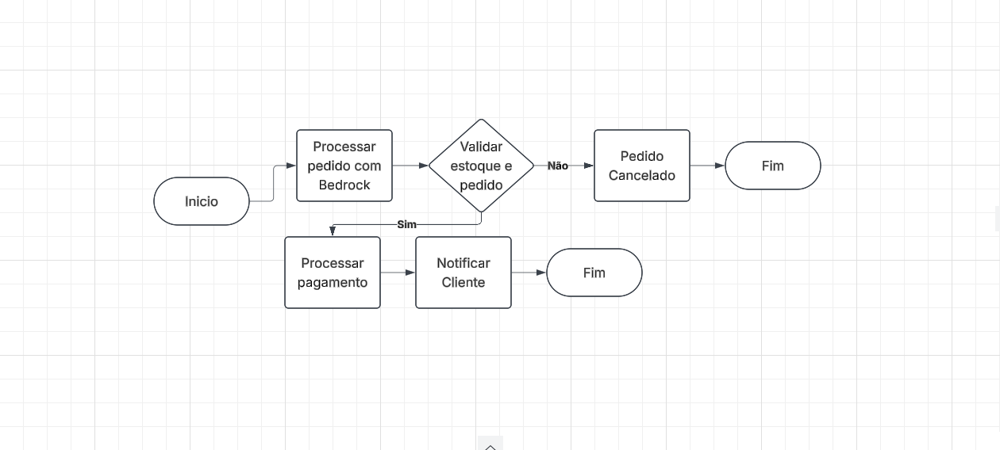

# 🛵 Assistente de Delivery com AWS Step Functions & Amazon Bedrock

Projeto desenvolvido para o desafio prático da **DIO (Digital Innovation One)**, focando na orquestração serverless e integração com IA Generativa na nuvem AWS.

---

## 🎯 Objetivo
Orquestrar o fluxo automatizado de atendimento e processamento de pedidos de delivery, utilizando o Amazon Bedrock para interpretar as solicitações do cliente em linguagem natural e o AWS Step Functions para gerenciar cada etapa da transação com controle de erros.

---

## 📐 Arquitetura do Fluxo

---

## 🛠️ Tecnologias Utilizadas
* **AWS Step Functions:** Orquestrador do fluxo e controle de estados.
* **Amazon Bedrock:** Processamento e interpretação de linguagem natural.
* **JSON (ASL - Amazon States Language):** Linguagem usada para definir os estados da máquina.

---

## 🔄 Etapas do Processo
1. **`ProcessarPedidoComBedrock`:** Recebe o texto do cliente e extrai os itens e o endereço de entrega usando a IA Bedrock.
2. **`ValidarEstoqueEPedido`:** Verifica se o pedido é válido e se os dados estão corretos.
3. **`ProcessarPagamento`:** Executa a transação e simula a cobrança do pedido.
4. **`NotificarCliente`:** Envia a confirmação e o status final do envio ao cliente.
5. **`PedidoCancelado`:** Trata eventuais erros ou indisponibilidade de itens.

---

## 📂 Arquivos do Repositório
* `delivery-workflow.json`: Código de definição da máquina de estado pronto para importar na AWS.
* `fluxo-step-functions.png`: Imagem da arquitetura visual montada no Step Functions.

---
Desenvolvido por você durante o Bootcamp DIO! 🚀
